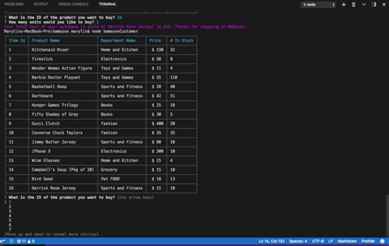

# bamazon
An Amazon-like storefront using MySQL. This app will take in orders from customers and deplete stock from the store's inventory.

### Overview
A command line Amazon-like store using `MySQL`, `Node.js`, `inquirer`. `cli-table` and `colors` packages were used for CLI display.  Take your pick between being the `bamazonCustomer`, `bamazonManager`, or `bamazonSupervisor`. Note: Overhead costs are pricy, but you can easily make it up with lots of sales.  

## bamazon Customer
* Start by entering `node bamazonCustomer` in your command line. 
* As soon as you enter, a catalog of what is in store will appear. 
> 
* You will be asked what id of the product you would like to buy and how many units. 
* Once the purchase is successful, you will receive a receipt. 
> 
* If the store does not have the correct quantity, CLI will display `Insufficient Quantity!` and prompt you to buy something else. 
> 

##bamazonManager
* Start by entering `node bamazonManager` in your command line.
* You will be a list of different tasks to choose from: View Products, View Low Inventory, Add to Inventory (i.e. Restock), Add New Product. 
    1. If you choose `View Products`: 
        * You will be shown a table of products in the inventory. 
        >> 
    

