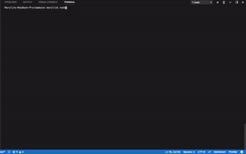
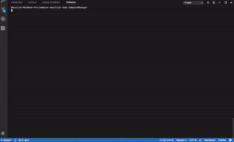
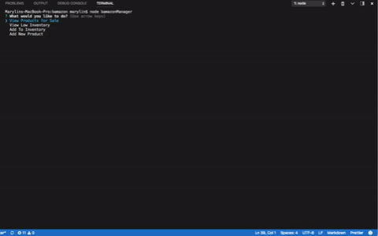
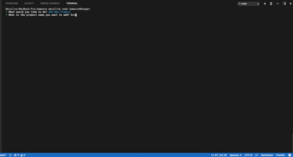
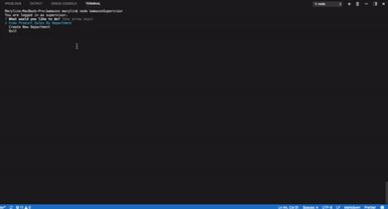

# bamazon
An Amazon-like storefront using MySQL. This app will take in orders from customers and deplete stock from the store's inventory.

### Overview
A command line Amazon-like store using `MySQL`, `Node.js`, `inquirer`. `cli-table` and `colors` packages were used for CLI display.  Take your pick between being the `bamazonCustomer`, `bamazonManager`, or `bamazonSupervisor`. Note: Overhead costs are pricy, but you can easily make it up with lots of sales.  

## bamazon Customer
* Start by entering `node bamazonCustomer` in your command line. 
* As soon as you enter, a catalog of what is in store will appear. 
> 
* You will be asked what id of the product you would like to buy and how many units. 
* Once the purchase is successful, you will receive a receipt. 
> 
* If the store does not have the correct quantity, CLI will display `Insufficient Quantity!` and prompt you to buy something else. 
> 
* To quit, either buy something and receive a receipt or press `Ctrl + C` in your command line. 

## bamazonManager
* Start by entering `node bamazonManager` in your command line.
* You will be a list of different tasks to choose from: View Products, View Low Inventory, Add to Inventory (i.e. Restock), Add New Product. 
    1. If you choose `View Products`: 
        * You will be shown a table of products in the inventory. 
        > 
    2. If you choose  `View Low Inventory`:
        * You will be shown a table of products in the inventory that is has less than 5 units in stock. 
        >   
    3. If you choose `Add to Inventory`:
        * You will be prompted what ID of the product you want to restock and how many units.
        * Upon success of restock, you will be notified of sucess and database/inventory will be updated. 
        >   
    4. If you choose `Add New Product`:
        * You will be prompted the name of the product you want to add, what department the new product belongs in, and how many units you want to add. 
        * Upon sucess, you will be notified and be asked if you want to do another task. 
        >   
* To quit, either pick `No` after finishing a task or press `Ctrl+C` in your command line.

## bamazonSupervisor
* Start by entering `node bamazonSupervisor` in your command line. 
* You will then be prompted to choose between `View Product Sales By Department` or `Add New Department`
    * If you choose `View Product Sales By Department`, you will be shown a table of department ids, department names, overhead costs, product sales, and total profit from sales made from bamazonCustomers. 
     > 
    * If you choose `Add New Department`, you will be asked name of the dept and overhead costs.
    * Upon success, you will be notified and your new department will be added to department data. 
     > 

             
    

